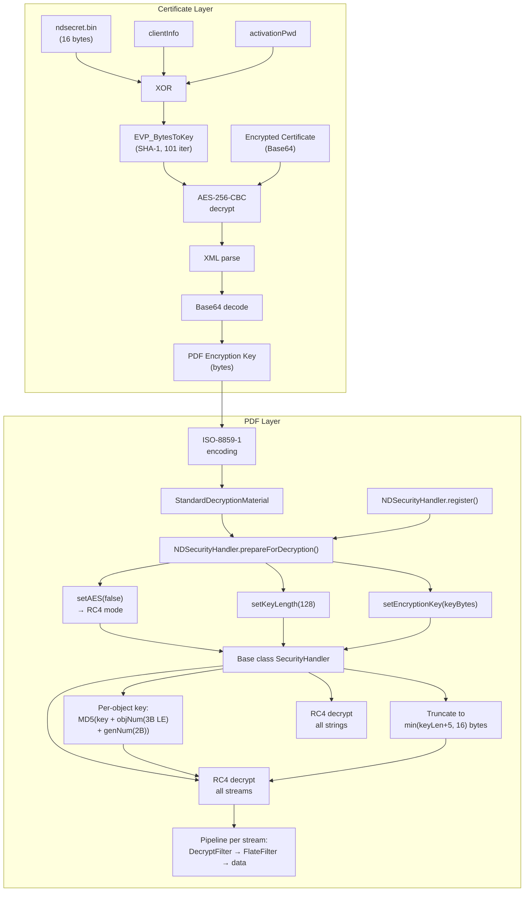

# NDPD CryptHandler - Reverse-Engineering & Decryption Analysis

## Overview

NewspaperDirect/PressReader (NDPD) employs a proprietary PDF encryption scheme using the filter name `/NDPD:CryptHandler`. This document provides a
comprehensive analysis of the encryption mechanism, derived from reverse-engineering the native Android library `libodyssey.so` extracted from the
[PressReader](https://play.google.com/store/apps/details?id=com.newspaperdirect.pressreader.android) APK version 6.6.240217 using Ghidra, and the resulting Java
implementation in LibrePress.

The analysis has been performed by the LLM [GLM-5.1](https://huggingface.co/zai-org/GLM-5.1) with a configured
[Ghidra MCP](https://github.com/bethington/ghidra-mcp) to access the binary decompilation.

---

## 1. Source Binary

| Property              | Value                                       |
|-----------------------|---------------------------------------------|
| **File**              | `libodyssey.so`                             |
| **Platform**          | Android ARM (native)                        |
| **Tool**              | Ghidra decompiler                           |
| **Symbol visibility** | Full C++ class/method names in symbol table |

---

## 2. C++ Class Hierarchy

The native library exposes the following relevant classes via its symbol table:

| C++ Class                              | Role                                                   |
|----------------------------------------|--------------------------------------------------------|
| `Parser::Drm::NdpdSecurityHandler`     | Custom security handler for NDPD encryption            |
| `Parser::Drm::StandardSecurityHandler` | Standard PDF security handler (for `/Standard` filter) |
| `Parser::Filters::DecryptFilter`       | Per-object stream/string decryption filter             |
| `Parser::PdfStreamReader`              | Constructs the filter pipeline for reading streams     |
| `Parser::Drm::SecurityHandler`         | Base class / factory for security handler dispatch     |

### Filter Pipeline Order

`PdfStreamReader` constructs the decryption pipeline as:

```
DecryptFilter → FlateFilter → ... (other filters)
```

Decryption is always applied **first**, before any decompression. This is critical: the stream is encrypted first, then compressed - so on read, decrypt first,
then decompress.

---

## 3. Encrypt Dictionary

From a real NDPD-encrypted test PDF, the encrypt dictionary contains:

| Key       | Value                  | Notes                             |
|-----------|------------------------|-----------------------------------|
| `/Filter` | `/NDPD:CryptHandler`   | Proprietary filter name           |
| `/V`      | `2`                    | RC4 with variable key length      |
| `/Length` | `128`                  | 128 bits = 16-byte encryption key |
| `/DOCID`  | *(document ID string)* | Standard PDF document identifier  |

---

## 4. Encryption Algorithm Selection

### `NdpdSecurityHandler::getEncAlgorithm()` (0x000b153c)

This function always returns `1`, which maps to **RC4**:

| Return Value | Algorithm |
|--------------|-----------|
| `1`          | RC4       |
| `2`          | AES       |

Despite the library containing a full AES decryption path, **NDPD always uses RC4**. The AES code exists in the binary as a generic capability of the
`DecryptFilter` but is never triggered by the NDPD handler.

---

## 5. Key Derivation

### `DecryptFilter::DecryptFilter()` (0x000b1734)

This constructor derives a per-object decryption key from the document's encryption key and the object's number/generation. This matches the PDF specification's
Algorithm 1, with NDPD-specific behavior for RC4.

#### RC4 Path (encAlgorithm == 1)

```
finalKey = MD5(encryptionKey || objNum(3 bytes LE) || genNum(2 bytes LE))
truncLen = min(encryptionKey.length + 5, 16)
finalKey = finalKey[0..truncLen-1]
```

**No "sAlT" salt** is appended for RC4.

#### AES Path (encAlgorithm == 2) - present but unused by NDPD

```
finalKey = MD5(encryptionKey || objNum(3 bytes LE) || genNum(2 bytes LE) || "sAlT")
truncLen = min(encryptionKey.length + 5, 16)
finalKey = finalKey[0..truncLen-1]
```

The 4-byte ASCII salt `"sAlT"` is appended before MD5 hashing. This matches the PDF specification's AES key derivation.

#### Key Truncation

Both paths truncate the MD5 output: `if (0xf < (iVar4 + 5)) puVar2 = &DAT_00000010`. This means:

- If `keyLen + 5 > 16` (i.e., key length > 11 bytes), truncate to **16 bytes**
- Otherwise, use `keyLen + 5` bytes

For the common case of a 16-byte key (128-bit): `16 + 5 = 21 > 16`, so the final RC4 key is **16 bytes** from the MD5 digest.

#### Key Derivation Pseudocode

```c
// RC4 key derivation (NDPD actual path)
buffer = alloc(keyLen + 9);  // +5 for obj/gen, +4 for AES salt (unused in RC4)
memcpy(buffer, encryptionKey, keyLen);
buffer[keyLen + 0] = (objNum >>  0) & 0xFF;  // objNum little-endian 3 bytes
buffer[keyLen + 1] = (objNum >>  8) & 0xFF;
buffer[keyLen + 2] = (objNum >> 16) & 0xFF;
buffer[keyLen + 3] = (genNum >>  0) & 0xFF;  // genNum little-endian 2 bytes
buffer[keyLen + 4] = (genNum >>  8) & 0xFF;

md5Input_len = keyLen + 5;  // NO salt for RC4
md5Result = MD5(buffer, md5Input_len);

truncLen = min(keyLen + 5, 16);
rc4InitKey(md5Result, truncLen, &state);
```

---

## 6. Stream Decryption

### `DecryptFilter::readByte()` (0x000b164c)

Per-byte decryption dispatches based on `encAlgorithm`:

#### RC4 (encAlgorithm == 1)

```c
byte = readNextByte();
return rc4DecryptByte(byte, &state);
```

Standard RC4 PRGA - each byte is XOR'd with the next keystream byte. The RC4 state is initialized once per object in the constructor.

#### AES (encAlgorithm == 2) - present but unused by NDPD

```c
// Read 16 bytes into block buffer
// Call aesDecryptBlock(buffer, &state, isLastBlock)
// Return bytes from decrypted output buffer
```

Critical finding: **No IV extraction from the stream.** The first 16 bytes of the encrypted stream are fed directly into `aesDecryptBlock()`, not treated as a
prepended IV. This means the implementation uses **AES-CBC with a zero IV** (all 16 IV bytes = 0x00).

### `aesDecryptBlock()` (0x000af2f0)

Confirmed AES-CBC by the XOR operations:

- Before the AES block decryption: XOR with the previous ciphertext block (CBC chaining)
- On the first block: XOR with the zero IV
- After decryption: the XOR is already applied, yielding plaintext

Padding removal is controlled by the `param_3` (isLastBlock) flag, consistent with PKCS7 padding.

---

## 7. RC4 Implementation

### `rc4InitKey()` (0x000aefa8)

Standard RC4 Key Scheduling Algorithm (KSA):

```c
for (i = 0; i < 256; i++) S[i] = i;
j = 0;
for (i = 0; i < 256; i++) {
    j = (j + S[i] + key[i % keyLen]) & 0xFF;
    swap(S[i], S[j]);
}
```

### `rc4DecryptByte()` (0x000aeff4)

Standard RC4 Pseudo-Random Generation Algorithm (PRGA):

```c
i = (i + 1) & 0xFF;
j = (j + S[i]) & 0xFF;
swap(S[i], S[j]);
t = (S[i] + S[j]) & 0xFF;
return byte ^ S[t];
```

Both are textbook RC4 - no modifications or proprietary extensions.

---

## 8. Verification Results

Manual decryption tests confirmed the analysis:

| Object         | Type                | RC4 Decrypt →          | Interpretation                     |
|----------------|---------------------|------------------------|------------------------------------|
| 12, 13, 14, 15 | Image streams       | `FF D8 FF EE...`       | JPEG header ✅                      |
| 3              | Page content stream | `71 0a 31 20 69 20...` | Valid PDF content (`q\n1 i ...`) ✅ |

The page content stream initially appeared to produce non-zlib output, but this was because the stream needed FlateFilter decompression **after** decryption.
After PDFBox's full pipeline (decrypt → decompress), the content decoded correctly as standard PDF page operators.

---

## 9. PDFBox Integration

### Architecture

LibrePress integrates with Apache PDFBox 3.0.7 by implementing a custom `SecurityHandler` that registers with PDFBox's `SecurityHandlerFactory` for the filter
name `"NDPD:CryptHandler"`.

### Implementation Files

| File                           | Package                              | Role                                                                |
|--------------------------------|--------------------------------------|---------------------------------------------------------------------|
| `NDSecurityHandler.java`       | `it.kapfer.librepress.pdf`           | Custom security handler for NDPD                                    |
| `NDProtectionPolicy.java`      | `it.kapfer.librepress.pdf`           | Dummy protection policy (required by PDFBox API)                    |
| `EncryptionKeyProvider.java`   | `it.kapfer.librepress.drm`           | Extracts the PDF encryption key from the certificate                |
| `NDCertificateEncryption.java` | `it.kapfer.librepress.drm`           | Decrypts the certificate using AES-256-CBC (OpenSSL EVP_BytesToKey) |
| `DecryptionException.java`     | `it.kapfer.librepress.drm.exception` | Runtime exception for decryption failures                           |

### Key Design Decision: Delegate to Base Class

The final `NDSecurityHandler` design **delegates all RC4 decryption to PDFBox's base `SecurityHandler`** class. This was not the initial approach.

#### Initial (Failed) Approach

1. Set `setStreamFilterName(COSName.IDENTITY)` and `setStringFilterName(COSName.IDENTITY)` to prevent the base class from applying any filter
2. Override `decrypt()` to manually handle all decryption
3. **Problem**: PDFBox's `COSParser` only calls `decrypt()` for **indirect objects** (objects with a valid object number). Page content streams stored as direct
   `COSStream` objects had `obj=-1, gen=-1`, so `decrypt()` was never called for them. These streams remained encrypted, causing `FlateFilter` errors on
   decompression of still-encrypted data.

#### Final (Working) Approach

1. Set `setAES(false)` in `prepareForDecryption()` - this tells the base class to use RC4, not AES
2. Do **NOT** set IDENTITY filter names - let the base class apply its standard RC4 decryption
3. The base class's `calcFinalKey()` produces the correct NDPD key derivation when `useAES=false`:
    - It does **NOT** append `AES_SALT` ("sAlT") when AES is disabled
    - It computes `MD5(encryptionKey + objNum(3B LE) + genNum(2B LE))`
    - It truncates to `min(keyLen + 5, 16)` bytes
    - This matches the native `DecryptFilter` RC4 path exactly

### Encryption Key Delivery

The encryption key (raw bytes obtained from the certificate via `EncryptionKeyProvider`) is passed to PDFBox through the `StandardDecryptionMaterial` password
mechanism. Since PDFBox's `SecurityHandler` treats the password as a `String`, the raw key bytes must survive the `String` round-trip:

```java
// Encoding: key bytes → ISO-8859-1 String (1:1 byte-to-char mapping)
String password = new String(encryptionKey, StandardCharsets.ISO_8859_1);
StandardDecryptionMaterial material = new StandardDecryptionMaterial(password);

// Decoding: inside prepareForDecryption()
byte[] encryptionKey = password.getBytes(StandardCharsets.ISO_8859_1);
```

ISO-8859-1 is chosen because it provides a bijective mapping between bytes 0x00–0xFF and Unicode code points U+0000–U+00FF. No byte values are lost or
transformed.

### NDSecurityHandler Implementation Summary

```java
public class NDSecurityHandler extends SecurityHandler<NDProtectionPolicy> {
    private static final String FILTER_NAME = "NDPD:CryptHandler";

    public static void register() {
        // Register with PDFBox's SecurityHandlerFactory
    }

    @Override
    public void prepareForDecryption(...) {
        // 1. Validate cryptVersion == 2
        // 2. Recover key bytes via ISO-8859-1
        // 3. setAES(false) → RC4 mode
        // 4. setKeyLength(keyBytes.length * 8) → in bits
        // 5. setEncryptionKey(keyBytes)
    }

    @Override
    public void prepareDocumentForEncryption(PDDocument doc) {
        throw new UnsupportedOperationException("Encryption not supported - decryption only");
    }
}
```

---

## 10. Certificate Decryption Pipeline

The PDF encryption key is not stored directly - it is contained within an encrypted certificate that accompanies each newspaper issue. The certificate
decryption uses a separate, unrelated cryptographic scheme.

The analysis has been performed by a human.

### Certificate Encryption Scheme

| Property            | Value                               |
|---------------------|-------------------------------------|
| **Algorithm**       | AES-256-CBC with PKCS5Padding       |
| **Key Derivation**  | OpenSSL `EVP_BytesToKey`            |
| **Hash**            | SHA-1                               |
| **Iteration Count** | 101                                 |
| **Salt**            | `1c fd f5 4e 17 60 09 39` (8 bytes) |
| **Secret Source**   | `ndsecret.bin` resource (16 bytes)  |

### Key Derivation for Certificate

1. Load the 16-byte secret from `ndsecret.bin`
2. XOR the secret with client-specific information:
    - **Client ID mode**: XOR each byte of secret with bytes of `clientNumber` (4-byte int, cyclically)
    - **Client ID + Address mode**: additionally XOR with MAC address characters
    - **Activation password mode**: XOR each byte with password characters (cyclically)
3. Derive AES key + IV using OpenSSL `EVP_BytesToKey(SHA-1, salt, clientSpecificSecret, 101)`
4. Decrypt the certificate with AES-256-CBC
5. Parse the decrypted XML to extract the `<encryptionKey>` (Base64-encoded)
6. Base64-decode to obtain the raw PDF encryption key bytes

---

## 11. End-to-End Decryption Flow



---

## 12. AES Path Analysis (Unused by NDPD)

Although NDPD always uses RC4, the native library contains a complete AES decryption implementation. This is documented here for completeness and potential
future encounters with NDPD-encrypted files that might use AES.

### Differences from RC4 Path

| Aspect                   | RC4 (NDPD actual)       | AES (present but unused)             |
|--------------------------|-------------------------|--------------------------------------|
| **Key derivation input** | `key + objNum + genNum` | `key + objNum + genNum + "sAlT"`     |
| **Salt**                 | None                    | 4-byte `"sAlT"` ASCII                |
| **MD5 input length**     | `keyLen + 5`            | `keyLen + 9`                         |
| **Key truncation**       | `min(keyLen+5, 16)`     | `min(keyLen+5, 16)`                  |
| **Cipher mode**          | Stream cipher (RC4)     | AES-CBC                              |
| **IV**                   | N/A                     | **Zero IV** (16 × 0x00)              |
| **IV source**            | N/A                     | Not extracted from stream            |
| **Block size**           | 1 byte                  | 16 bytes                             |
| **Padding**              | N/A                     | PKCS7-like (stripped on isLastBlock) |

### Critical AES Implementation Detail

The AES path uses **CBC mode with a fixed zero IV** - it does **not** extract a 16-byte IV from the beginning of the encrypted stream. This differs from the PDF
specification's standard AES encryption (which prepends a random 16-byte IV to each encrypted stream). Any implementation targeting the AES path must use a zero
IV, not a stream-prepended IV.

---

## 13. Security Assessment

| Component                                | Assessment                                                                                                    |
|------------------------------------------|---------------------------------------------------------------------------------------------------------------|
| **RC4**                                  | Cryptographically broken - multiple known biases in RC4 keystream                                             |
| **128-bit key**                          | Adequate key length, but RC4 weaknesses reduce effective security                                             |
| **MD5**                                  | Cryptographically broken - collision attacks possible, but preimage resistance still holds for key derivation |
| **No password authentication**           | NDPD encryption has no owner/user password verification - anyone with the key can decrypt                     |
| **Certificate encryption (AES-256-CBC)** | Reasonably strong, but uses SHA-1 (deprecated) and only 101 iterations (vulnerable to brute force)            |

---

## 14. References

### PDF Specification

- **Algorithm 1**: RC4 key derivation - ISO 32000-1, §7.6.2, "Algorithm 1: Encryption of data using the RC4 or AES algorithms"
- The NDPD RC4 path matches Algorithm 1 exactly when AES is not used (no "sAlT" salt)

### Binary Addresses

| Function                                 | Address      |
|------------------------------------------|--------------|
| `NdpdSecurityHandler::getEncAlgorithm()` | `0x000b153c` |
| `DecryptFilter::DecryptFilter()`         | `0x000b1734` |
| `DecryptFilter::readByte()`              | `0x000b164c` |
| `rc4InitKey()`                           | `0x000aefa8` |
| `rc4DecryptByte()`                       | `0x000aeff4` |
| `aesDecryptBlock()`                      | `0x000af2f0` |
| `PdfDocument::checkEncryption()`         | `0x00099584` |
| `PdfStreamReader::PdfStreamReader()`     | `0x000aee70` |
